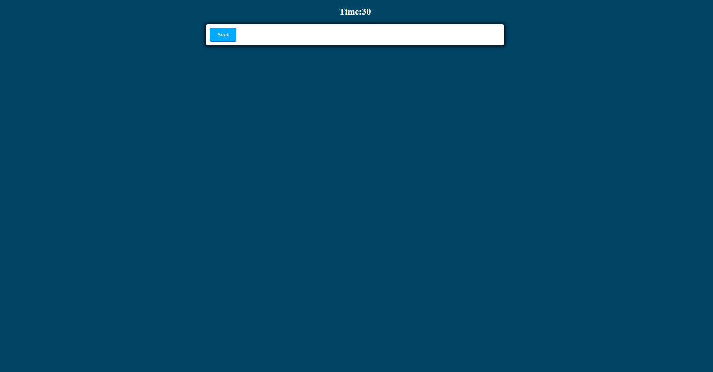

# Coding-Quiz

Button asking user to start the quiz

User will be prompted with a series of questions and will have four options to pick from

If correct user will be alerted saying "Correct!" and if wrong user will be prompted with "Wrong!"

Game continues until no questions remain

